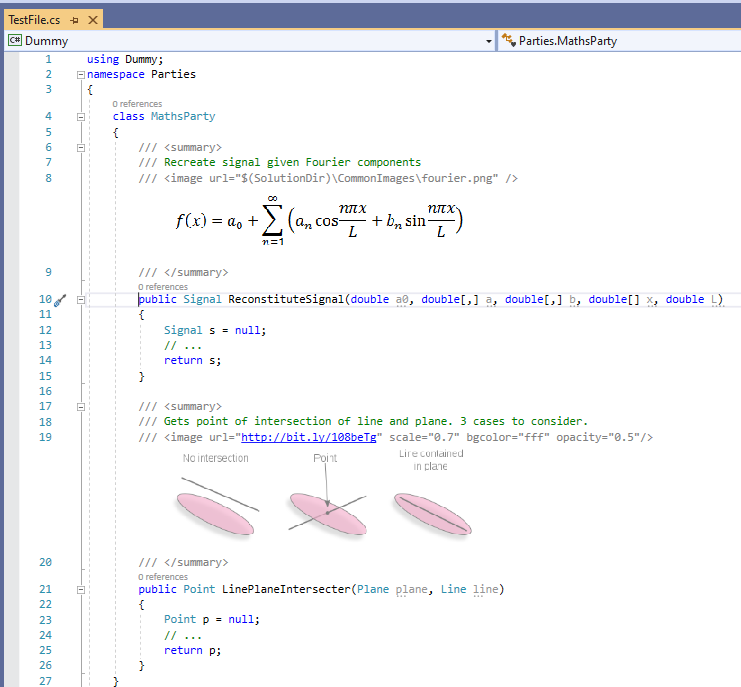
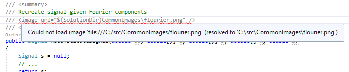

# ImageComments (a Visual Studio Extension)

## Overview
This is an extension for the Visual Studio code editor that allows images to be displayed amongst code, allowing for visually rich comments. For example...

## Usage Info

### Preamble
Disclaimer: This project is a WIP and it's pretty rough around the edges. Please report issues on the GitHub repo.

Supported Visual Studio Verions: 2019 (though earlier releases support 2010~2017)

### Download/Installation
[Latest 1.2.0.0](https://github.com/lukesdm/image-comments/raw/master/Output/ImageComments.vsix)

To install double-click/activate the VSIX file.

### How to use
Image-comments are declared with:

`/// <image url="X:\Path\To\Image.ext" scale="1.5" />` or `/// `

The optional `scale` attribute multiplies the source width and height (ranges from 0.01 to 100). Since 1.1.4.4 scaled images are anti aliased.

The optional `opacity` attribute is available since 1.1.4.4 (from 0.0 to 1.0):
`/// <image url="..\Image.ext" opacity="0.6" />`

`// <image url="X:\Path\To\TransparentImage.png" bgcolor="ffffff" />`
You can also specify the `bgcolor` attribute to set a background color for pictures with transparent areas, the color is specified as hex number: RRGGBB or RRGGBBAA, optionally you can use a short hand notation RGB.

You can use the VS environment variables $(ProjectDir), $(SolutionDir), and $(ItemDir) in URLs, e.g.:

`# <image url="$(SolutionDir)\CommonImages\Fourier.jpg" />` 

From 1.1.4.3 on you can also use relative paths (relative to the source file).

Images from URL will be downloaded and not updated as long as the file exists in the user temp directory.

Please note, if you use docfx at the same time, these environment variables must not be used, because docfx expects the images in a directory, e.g. "./images".

Images are displayed using the [WPF Image control](http://msdn.microsoft.com/en-us/library/ms610982) with a [BitmapFrame](http://msdn.microsoft.com/en-us/library/ms619213) source, and accepted image and URL formats are tied to those, e.g. BMP, PNG, JPG all work as image formats, and C:\Path\To\Image.png, http://www.server.com/image.png and \\\server\folder\image.png all work as URLs.

If there's a problem trying to load the image or parse the tag, the tag will be squiggly-underlined and hovering over this will show the error, e.g

The languages currently supported are Python, C#, F# (fixme), C, C++ and VB.

Image-comments don't really have anything to do with XML comments, but the format is convenient and it should be pretty straight-forward to transform them for Sandcastle documentation creation.

The extension adds a command in the Tools menu to toggle image-comment display on or off.

### Uninstallation
In VS, open the Extension Manager, select ImageComments, then click uninstall. A restart of VS is required.

### Some known issues
* After adding an image-comment using a local image, you can't edit the image until VS is closed.
* The caret/selection highlight height on image-comment lines grows as high the image.
* You need to scroll/'bump' the editor window to see the effect of the on/off toggle command.

## Development Info
Requires: Visual Studio 2015 SDK

### Build instructions
Providing the VS SDK is installed, you should be able to build by opening the solution and hitting F6. Debugging has to be configured manually - On the Project Properties->Debug tab, choose 'Start External Program' and command line e.g. (if using default install location) 'C:\Program Files (x86)\Microsoft Visual Studio 12.0\Common7\IDE\devenv.exe' with arguments '/rootsuffix Exp'. The 'Release' build configuration copies the .vsix package into the Solution's .\Output directory.

### Program structure
It's a very small project and may be fairly self explanatory if you are familiar with Visual Studio editor extensions.
There are two components to the extension:

* ImageCommentsEditorComponent. Contains 97% of the functionality.
* ImageCommentsPackage. Adds a command to enable/disable functionality; VSIX definition.

For testing information, see .\Testing\Testing.html

### Some known implementation issues
The code is a bit rough - it may not need a rewrite from scratch, but there's a bunch of stuff to be done

* Images downloaded from an URL might not show up right away
* Error/exception handling should be improved
* Program/project structure could be improved
* No automated tests and manual testing has been limited.
* There are some fairly obvious potential optimisations, but so far performance impact on plain Visual Studio seems minimal (in a release build on a 1.4GHz Core 2 Duo laptop with 1GB RAM). It would probably just add unneccessary complexity, but further testing might show otherwise.
* ...

## License
Eclipse Public License v1.0. See [license text](http://github.com/lukesdm/image-comments/raw/master/License.txt) for details.

## Authors & Contributors
Luke McQuade (creator), Thomas Pollak, Lionsoft, Oleg Kosmakov, Morten Engelhardt Olsen, Wolfgang Kleinschmit, Sören Nils Kuklau, Tim Long, [your name here]
